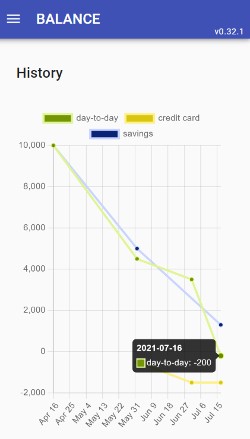
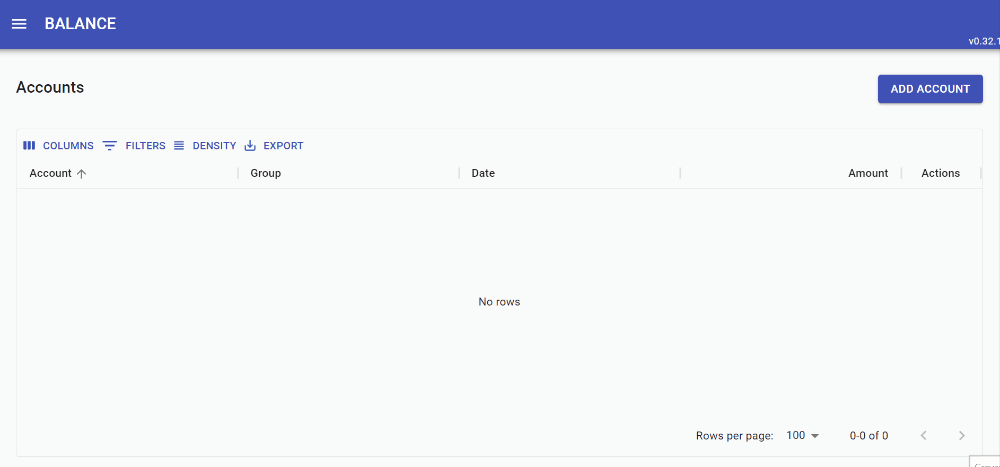
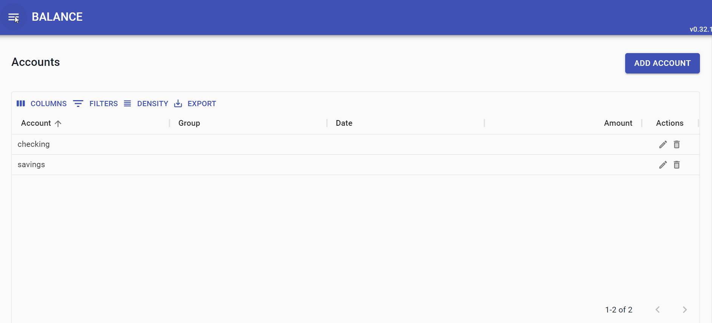
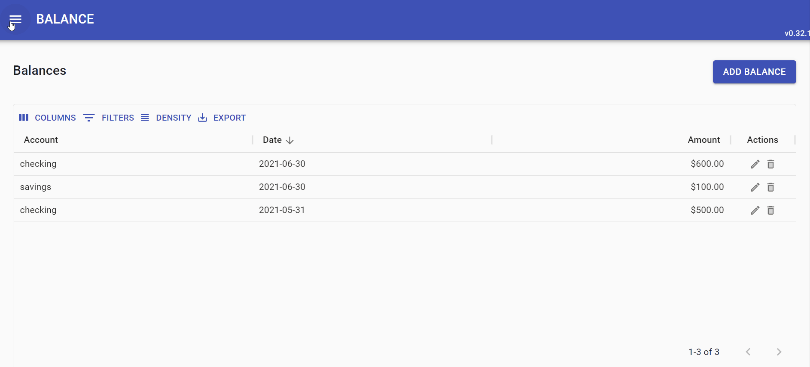
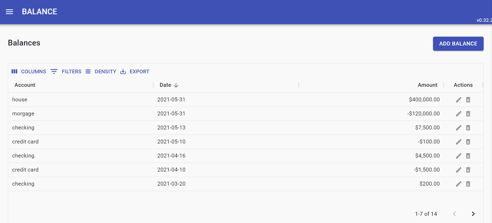

[](https://codecov.io/gh/joaomelo/balance)

# TL;DR
_What problem it solves?_

Balance is a minimal solution for finance self-management. It can record accounts balances (from credit cards or loans for example) and show their evolution in a chart.

It is an unsophisticated software which tries to settle the need for minimal personal finance management for someone ~~too lazy~~ unable to do the correct tracking based on individual transactions, category analysis and accounts reconciliation. 

# Motivation
_Why it was built?_

The problem can surely be solved with some spreadsheet shenanigans. Though, why lose some hours learning how to implement an algorithm in Excel if you can burn dozens more coding your own software?

Seriously, I built the project mainly to explore in practice some techs and architectural approaches in a front-end web app. Mostly:
- feasibility of single page applications without a traditional backend using serverless services;
- some concepts from [Clean Architecture](https://www.amazon.com/Clean-Architecture-Craftsmans-Software-Structure-ebook-dp-B075LRM681/dp/B075LRM681/ref=mt_other?_encoding=UTF8&me=&qid=) and [Grokking Simplicity](https://www.manning.com/books/grokking-simplicity?gclid=CjwKCAjw3MSHBhB3EiwAxcaEu7fdoYDomaXaYdL8obQ_-fKzSvr_gqgYZzf_s53g9lpfPHfTnG1sARoCFLYQAvD_BwE);
- UI craft with React functional components and hooks;
- reactive state management without a central store like Redux or Vuex;
- end-to-end testing with Microsoft Playwright.

# Usage
_What are the features?_

The main output is a time series chart to assess the net balance evolution from accounts and groups. We can see a naive example below. 



But the first step is to feed the relevant data.

## Accounts

Accounts can be used to represent things like savings, credit cards, loans, long term investments and assets as houses or cars. Bellow an example on how to create an account in the app.



## Balances

A balance states the net value for one account at a given day. Here we create some balance records:



## Groups

Accounts can be optionally grouped. Every group will appear as an additional time series in the history chart with calculated balances based on the accounts they aggregate.



## History Chart

The history chart shows the balance progression for every account and group. The chart is interactive and series can be hidden to facilitate analysis.

Groups balances are the sum of its accounts balances. The calculation will deal with mismatch dates using the most recent past balance at a given date.

The follow example show the history chart for two groups with two accounts each. 



# Runtime
_What lives in the runtime?_\
_How to run locally?_

## Components
Balance is a traditional single page application. The production artifacts are one HTML file and some JavaScript files. I use [Firebase hosting](https://firebase.google.com/docs/hosting) to serve them, but any other web server will do just fine.

During runtime, the web app relies on two serverless services provided by [Firebase](https://firebase.google.com/). [Firestore](https://firebase.google.com/docs/firestore) to save data related to accounts, groups, and balances and [Firebase Auth](https://firebase.google.com/docs/auth) supports user authentication.

## Local Environment

The first step to run Balance in your local machine is download the project. GitHub offers many ways to do that. For example, you could clone the repo with git.

``` bash
git clone https://github.com/joaomelo/balance.git
```

After that, go to the project directory and install both the JS dependencies and the [Firebase CLI](https://firebase.google.com/docs/cli).

``` bash
npm i
npm install -g firebase-tools
```

Now link the directory to a Firebase project you already [created and set up](https://firebase.google.com/docs/web/setup) on their platform.

``` bash
firebase use some-project-id
```

The last step is rename the `.env.exampe` file to just `.env`. For the local environment this is enough, but the `.env` file will need further updates if we want to deploy to the cloud.

To run Balance type `npm start`. It will be available at `http://localhost:8181`. The default local user credentials are:

```
user: sofia@email.com
password: password
```

# Development
_How to change it?_

Making changes is straightforward after you already set the local environment. Let me just cover a few more things. First let us familiarize with the project folder structure.

``` js
📂balance
  *.*             // project config files
  📁.github       // github actions ci/cd pipeline
  📁dist          // bundled code for production
  📁src
    📁app         // general app logic
    📁components  // ui shared components
    📁features    // core business
    📁services    // external services abstractions
    📁main        // glues everything
  📁tests         // support test files
```

The code spread in those folders takes advantage of the JavaScript thriving open source ecosystem. [React](https://reactjs.org/), [Material-UI](https://material-ui.com/) and [Chart.js](https://www.chartjs.org/) are the UI backbone. [RxJS](https://rxjs.dev/) supports the state management. [Playwright](https://playwright.dev/) and [Jest](https://jestjs.io/) enable unit and e2e testing. The [package.json](package.json) file lists the many others libraries I was fortune to have access to.

To support the development effort we have both unit and e2e tests. To run all the tests in watch mode, just type `npm test`.

The project uses [Jest](https://jestjs.io/) for testing. By executing `npm start`, you turn on tests in watch mode and can begin coding. It is easy to focus on a particular module applying file patterns through Jest CLI options.

But be aware these tests don't massage the final serverless functions. These functions are tiny and take care only of putting together dependencies. Nevertheless, If you want to run them locally, type the command `npm run shell`.

The [shell interface](https://firebase.google.com/docs/functions/local-shell) enables local interactive invoke of Firebase functions from the command line.

# Wrapping up
_What to expect?_

The project has very limited ambitions. Although some bugs will undoubtedly come, there are not many more things to do as long as I can see. If you need any help, I'm glad to listen. Just contact me via [Twitter](https://twitter.com/joaomeloplus).

🖖 Live long and prosper.

# License
Made by [João Melo](https://twitter.com/joaomeloplus) and licensed under the GNU General Public License v3.0 — see the [LICENSE](LICENSE) file for details.

## --- IGNORE THE TEXT BELOW ---
**from here on, everything are notes to help complete the final README**

# Deploy
_How to deploy to production from my machine?_
_How to use Guthub actions?_

## Locally

You can deploy the serverless functions to Firebase from your local machine. To do that, execute `npm run deploy:local`.

This command will take advantage of the same `.env` file used for development and the Firebase project configuration.

## Continuous Delivery

There is also a workflow to deploy automatically from GitHub using GitHub Actions.

This pipeline additionally uploads test reports to [Codecov]( https://about.codecov.io) service. Codecov generates complete and interactive code coverage reports. You can create a free account and obtain an API key on their website.

Going back to GitHub Actions, you need to set some GitHub variables for things to work correctly. You do that by creating a GitHub secret for every workflow variable. The secrets required are listed below.

```
FIREBASE_PROJECT 
FIREBASE_TOKEN
SCALE_SERP_KEY
SEND_GRID_KEY
DEFAULT_FROM_EMAIL
CODECOV_TOKEN
```

# Contribution
_Should I help?_

Lembrar do podcast com o cara do SQLite no changelog.
